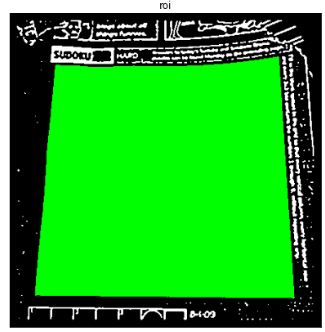
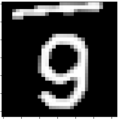

# Sudoku Solver

## App description
The app can grab a sudoku puzzle from a given image, solve and write back the solution to the original image. Python and opencv has been used to grab, process the sudoku puzzle extract digits and their relative positions on the board. It then feeds the digits to a CNN for recognition. The tensorflow CNN has been trained on a subset of Char74k dataset for digits in common computer fonts. The sudoku is solved using a greedy backtracking algorithm to reduce the branching factor.


This project consist of mainly experimental exploration of best possible ways to detect, recognize and solve a noisy sudoku image using  jupyter notebooks

## Solving Process

(refer to notebook **sudoku.ipynb** for detailed steps)
### The detection and solving proceed through the following major steps:
* converting image to grayscalesdf
<p float="left">
  
</p>

* blurring (to remove noise) and adaptive thresholding
<p float="left">
  
</p>

* reverting color, trying out opening vs median filter, median giving better results in removing white dots without removing the required detail (digits)
  

* detecting largest contour ( assuming user usually focuses on the sudoku) and generate a binary mask, this masks out the required object removing all the other unnecessary details, after that detect corners using Shi Tomasi corner detector
  <p float="left">
    
    
    
  </p>

* using perspective transform with the 4 corner points to unwrap the image, here we also find the transformation matrix, After that we draw black Hough lines to remove the border lines, this helps in getting cleaner digit imgs
  <p float="left">
    
    
    
  </p>

* we then segment the image into 81 images considering it as a 9x9 matrix
  <p float="left">
    
  </p

* we need to feed only digits into the neural net for detection, leaving out noisy cells. To detect this we process each image *(hover over)* and
  
    1. check the ratio of black to white pixels in the near center of the image (helps to remove boundary noise), if black pixels are more label it as noise
    2. detect the largest contour object, extract it, center and finally resize it appropriate for the neural net
   
  <p float="left">
    
    
    
  </p>

* Our final number grid after processing each image cell
  <p float="left">
    
  </p>
  
* We feed the non noise images through a CNN to detect the number and create a matrix, to solve this we use a **greedy best first backtracking algorithm**. The basic backtracking algorithm is similar to the N-Queens problem, but targetting the next cell to be searched as the one with the minimum number of possibilities helps to reduce the branching factor thus solving expert level sudokus in under a second *(sudoku_backtrack_greedy.py)*
  <p float="left">
    
  </p>
* We now need to apply the inverse perspective transformation to wrap the image back to its original state, after which we replace the pixels of our original image with the non zero pixels of our solution image
<p float="left">
  
  
</p>

<br><br>
### Training the Neural Network 
(refer to notebook **digit_recognition_trainer.ipynb** for detailed steps)

Since most of the sudoku puzzels are digital printed, we use the Char74k computer font dataset, for this model I selected about 150 images per digit, and each was preprocessed into the required format to train. The original image is a 128 X 128 image. Using the *create_dataset.py* script I created a directory of processed number each of which is a centered 32 x 32 image

<p float="left">
    
    
  </p>

### CNN Model used
```python
model =  Sequential()
model.add(Conv2D(32,kernel_size=(3,3),activation="relu",input_shape=input_shape))
model.add(Conv2D(64,kernel_size=(3,3),activation="relu"))
model.add(MaxPooling2D(pool_size=(2,2)))
model.add(Dropout(0.25))
model.add(Flatten())
model.add(Dense(128,activation="relu"))
model.add(Dropout(0.5))
model.add(Dense(len(CATEGORIES),activation="softmax"))
```
Using the preprocessed images, with about 1350 imgs the model gives a **validation accuracy of 97%**

The trained model weights were saved to **sudoku_number_model.h5**, to be used later in the sudoku.ipynb file

The notebook sudoku.ipynb has been tested on a number of test images available in ./datasets folder


